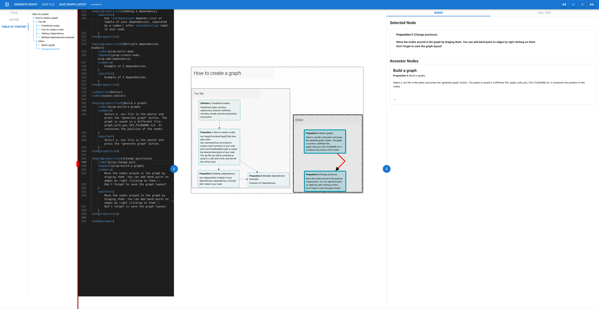
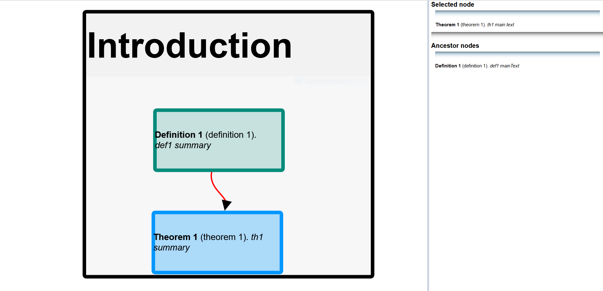

# MathResultsGraph

Set of tools to extract a graph of mathematical results from a .tex file, and display said graph in a Browser. 
Note that Firefox and Safari have better support of mathamatical notations and hence work better than Chrome and Edge.

This is very much a Work in Progress and feel free to contact me for any question.


# BETA VERSION

A Beta version of the editor is avaliable. It has been rewritten using the quasar framework. I can be downloaded in the release page. To install, you need python, then!
``` pip install api``` 
Then
```python server.py``` 
Then open a webbrowser at http://localhost/8000



## Example:
### Interactive version
http://www.emmanuelchevallier.eu/graphSite/graph_split.html

### Screenshot


# Documentation

Documentation is available here: https://mathresultsgraph.readthedocs.io/en/latest/#

# Example annotated tex file:

``` 
\documentclass{article}
\usepackage[utf8]{inputenc}

\newcommand{\rank}[1]{}
\newcommand{\depends}[1]{}
\newcommand{\weakdepends}[1]{}
\newcommand{\summary}[1]{}
\newcommand{\mainText}[1]{#1}

\newtheorem{theorem}{Theorem}
\newtheorem{definition}{Definition}

\begin{document}


\section{Introduction}
\label{sec:intro}

\begin{definition}[definition 1]
    \label{def:def1}
    \summary{def1 summary}
    \mainText{def1 mainText}
\end{definition}

\begin{theorem}[theorem 1]
    \label{th:th1}
    \depends{def:def1}
    \summary{th1 summary}
    \mainText{th1 main text}
\end{theorem}

\end{document}
``` 

## resulting graph: 
Interactive version: http://augustin-chevallier.fr/testgraph/graph_split.html

Screenshot:



# TODO:
*   If pandoc is not installed, display an error message instead of crashing.
*   Ignor includes if commented
*   Loading bar when building graph
*   Display error messages when building graph
*   Better error messages